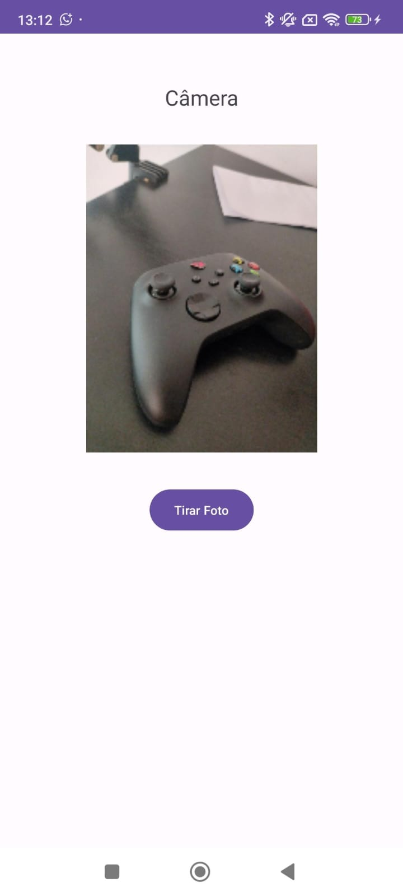
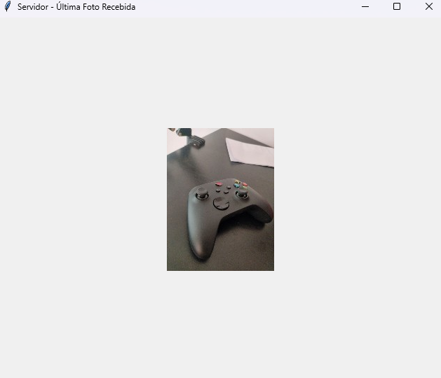

# App Android - Envio de Fotos para Servidor Python

Este aplicativo Android permite capturar uma foto usando a câmera do dispositivo e enviá-la automaticamente para um servidor Python via rede Wi-Fi.

## Estrutura do Projeto

```
androidApp/
└── app/
    ├── src/
    │   ├── main/
    │   │   ├── java/com/example/camera_project_app/MainActivity.kt
    │   │   ├── res/
    │   │   │   ├── layout/activity_main.xml
    │   │   │   ├── values/strings.xml
    │   │   │   └── ...
    │   │   └── AndroidManifest.xml
    │   └── test/
    ├── build.gradle.kts
    └── proguard-rules.pro
```

## Como Rodar o App

1. **Pré-requisitos**  
   - Android Studio instalado  
   - Celular ou emulador com Android >= 9 (minSdk 28)

2. **Configuração do IP do Servidor**  
   - No arquivo [`MainActivity.kt`](app/src/main/java/com/example/camera_project_app/MainActivity.kt), altere o valor da variável `SERVER_IP` para o IP do servidor Python na sua rede Wi-Fi:
     ```kotlin
     private val SERVER_IP = "192.168.1.113" // Altere para o IP do seu servidor
     ```
   - O campo está logo no início da classe [`com.example.camera_project_app.MainActivity`](app/src/main/java/com/example/camera_project_app/MainActivity.kt).

3. **Build e Execução**  
   - Abra o projeto no Android Studio.
   - Conecte seu dispositivo ou inicie um emulador.
   - Clique em "Run" para instalar e executar o app.

4. **Uso**  
   - Abra o app, clique em "Tirar Foto", permita o uso da câmera e a foto será enviada automaticamente para o servidor Python.

## Permissões Necessárias

- Câmera
- Internet

Essas permissões já estão declaradas no [`AndroidManifest.xml`](app/src/main/AndroidManifest.xml).

---

#### README do Servidor Python (`Sistemas-Distribuidos-Trabalho2/README.md`)

O README do servidor já está presente em [Sistemas-Distribuidos-Trabalho2/README.md](Sistemas-Distribuidos-Trabalho2/README.md) e explica:

- Como instalar dependências (`pip install Pillow`)
- Como rodar o servidor (`python server.py`)
- Estrutura de diretórios e arquivos gerados
- Protocolo de comunicação (4 bytes de tamanho + dados da imagem)
- Organização das imagens recebidas por data

Se quiser adicionar um passo sobre como mudar a porta ou IP, edite o início do arquivo [`server.py`](Sistemas-Distribuidos-Trabalho2/server.py):

```python
HOST = '0.0.0.0'  # Escuta em todas as interfaces de rede 
PORT = 5001       # Porta para escutar 
```

Para mudar a porta, altere o valor de `PORT`. Para escutar apenas em um IP específico, altere o valor de `HOST`.

---

Se precisar de mais detalhes ou exemplos, posso complementar!// filepath: c:\dev-mobile\camera-project\androidApp\app\README.md

# App Android - Envio de Fotos para Servidor Python

Este aplicativo Android permite capturar uma foto usando a câmera do dispositivo e enviá-la automaticamente para um servidor Python via rede Wi-Fi.

## Estrutura do Projeto

```
androidApp/
└── app/
    ├── src/
    │   ├── main/
    │   │   ├── java/com/example/camera_project_app/MainActivity.kt
    │   │   ├── res/
    │   │   │   ├── layout/activity_main.xml
    │   │   │   ├── values/strings.xml
    │   │   │   └── ...
    │   │   └── AndroidManifest.xml
    │   └── test/
    ├── build.gradle.kts
    └── proguard-rules.pro
```

## Como Rodar o App

1. **Pré-requisitos**  
   - Android Studio instalado  
   - Celular ou emulador com Android >= 9 (minSdk 28)

2. **Configuração do IP do Servidor**  
   - No arquivo [`MainActivity.kt`](app/src/main/java/com/example/camera_project_app/MainActivity.kt), altere o valor da variável `SERVER_IP` para o IP do servidor Python na sua rede Wi-Fi:
     ```kotlin
     private val SERVER_IP = "192.168.1.113" // Altere para o IP do seu servidor
     ```
   - O campo está logo no início da classe [`com.example.camera_project_app.MainActivity`](app/src/main/java/com/example/camera_project_app/MainActivity.kt).

3. **Build e Execução**  
   - Abra o projeto no Android Studio.
   - Conecte seu dispositivo ou inicie um emulador.
   - Clique em "Run" para instalar e executar o app.

4. **Uso**  
   - Abra o app, clique em "Tirar Foto", permita o uso da câmera e a foto será enviada automaticamente para o servidor Python.

## Permissões Necessárias

- Câmera
- Internet

Essas permissões já estão declaradas no [`AndroidManifest.xml`](app/src/main/AndroidManifest.xml).

---

#### README do Servidor Python (`Sistemas-Distribuidos-Trabalho2/README.md`)

O README do servidor já está presente em [Sistemas-Distribuidos-Trabalho2/README.md](Sistemas-Distribuidos-Trabalho2/README.md) e explica:

- Como instalar dependências (`pip install Pillow`)
- Como rodar o servidor (`python server.py`)
- Estrutura de diretórios e arquivos gerados
- Protocolo de comunicação (4 bytes de tamanho + dados da imagem)
- Organização das imagens recebidas por data

Se quiser adicionar um passo sobre como mudar a porta ou IP, edite o início do arquivo [`server.py`](Sistemas-Distribuidos-Trabalho2/server.py):

```python
HOST = '0.0.0.0'  # Escuta em todas as interfaces de rede 
PORT = 5001       # Porta para escutar 
```

Para mudar a porta, altere o valor de `PORT`. Para escutar apenas em um IP específico, altere o valor de `HOST`.

---

## Imagens do Projeto

Imagem enviada do app

Imagem recebida pelo servidor
